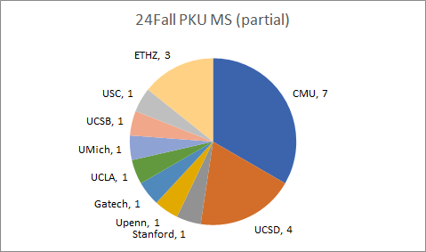

*Alice (301)*
=================

1. 专业课GPA比较重要，有些学校要求提供部分专业课的成绩
2. 弄清楚哪些学校收master（比如MIT不收master），避免申请到错误的学校或错误的项目
3. 申请master所需的成本较低，可以多申请几所学校（一般5所以上），大幅度降低全拒的概率
4. 填写申请表时要尽早开始，这样不容易犯错。比如导师的推荐信要设置成不能查看，SOP中不要出现明显的ChatGPT提示词等
5. CMU看重GRE成绩，申请CMU的master最好要考GRE
6. CMU的master可以同时申请多个项目，且每个项目的录取率，平均GRE成绩，培养方案，毕业后平均薪资等重要数据可以在官网查到，是很好的参考资料

*Bob (344)*
=================

关于推荐信：

首先引用 yzb 学长（https://github.com/ZhenbangYou/University-Application--Computer-Science-Graduates-/blob/2e8b3e908b94d82305526ea6cd1729e209a800dd/三：申请需要的几大材料.md?plain=1#L110）：（对于 master）“暑研推荐信是有风险的，如果贡献不够，且和老师不够熟，还是不要轻易要推荐信了（对于硕士，尤其是成绩不错的同学，强推没那么好用，黑推倒是很麻烦……）”

另外要推荐信的话，最好跟老师聊清楚，然后提前落实（有老师可能会一直鸽到很晚，得早点发多催一催，能用更直接的方式 (而不是 email) 催的话可能效果更好）

*Carol (138)*
=================

1. 绩点可以往高写，用WES还有scholaro等换算方法能涨些而且也会被认可，你北原始绩点不占优
2. 中介作用一般，就是定时提个醒，自己规划好就行
3. 多报多申，不用怕多交钱和多要推荐信，千万不要后悔
4. 英语早点考，省心
5. 可以多找国外的connection

*Dave (1264)*
=================

给cs学弟学妹的一些留学建议

### 一、关于英语

基本上项目都会有TOEFL和GRE的成绩要求（会在项目主页上，部分项目的GRE是optional的），建议提早考试，大一大二假期把英语考试结束会省去很多麻烦，因为大三的很可能需要做summer intern，别拖到大四。

我本人的英语水平入学时大概是C类（根据贵校标准），亲身经历是一个假期脱产准备一个考试绰绰有余，但是不要尝试在学期内同时准备英语考试，以信科的lab强度是不大可能的。

准备这两个考试的小建议：GRE可以全自学，语文部分的难度基本全部在单词上，背就完了，讲的就是一个力大砖飞；数学部分对于信科的同学应该没有难度，简单看一下专有名词就行。

TOEFL建议报班（自学惨痛经历），因为托福考试有很多所谓信息差的东西，尤其是作文部分，你最好完全知道“我需要写一个什么东西”以后再去考试。另外报班对于听力和口语练习有很大的帮助。

### 二、关于绩点

如果你打算申请硕士，请在大一和大二努力学习保持一个高的绩点，尤其是专业课。这个非常重要，cs硕士是很看重绩点的。不要把重要的专业课往后丢，比如数学课和四大礼包。如果培养方案允许，你可以考虑把政治课都丢到大四去拿60。

那么如何选择专业课呢？众所周知，贵校有极不稳定的选课系统和幽默的考试给分，因此给各位一个忠告，选择和努力一样重要，建议咨询一下学长学姐对于开课老师的评价，再进行选课，你要为自己的绩点负责。

如果你打算申请博士，绩点其实没什么意义，保持一个看得过去的成绩就好。

### 三、关于科研&进组

无论你打算申请硕士还是博士，有一份像样的科研经历都是很有帮助的，尤其是对于顶尖的项目。因此，你需要慎重选择科研方向。

对于硕士：

如果你的志向是general cs的硕士项目，那么科研具体方向其实不重要，因为这类项目其实不关心你到底是做什么的。你要做的应该是去找有影响力的导师，选更容易发paper的方向，把科研的功利性发挥到极致；或者干脆去投大厂的假期实习。

但是如果你的志向是某个细分的track，比如system，graphics之类，那么你最好再想想。因为当你踏入某个细分的track的实验室的时候，你基本就确定了自己申请项目的范围，很多项目从此就与你无缘了。有些研究领域本来就是小众的和不热门的，难发文章先不说，找到好的项目也比较困难。所以在此之前你就应该到cs ranking上去积极的搜索不同track对应的项目和学校，哪些学校有相关领域的导师，或者哪个学校根本没有相关领域的研究，然后再确定自己要进的项目组，不要单凭兴趣行事。（这里的前提假设是你希望自己硕士以后到业界直接工作，如果你希望深造，我建议你不要申请硕士，直接去读phd）可能有点功利，但是现在cs就是这样，你得去做热门方向。

另外一个小建议：如果你的研究方向在一个学校项目里完全不被涵盖，那么你个人陈述中过于强调对于这个track的兴趣会被认为是不match的，不如写点general cs的东西。

*Eve (6)*
=================

多看小红书x

*Francis (1599)*
=================

老生常谈的一些就不写了，别人肯定会写到，这里写一点个人在申请季中get到的一些小tips

### 一、省申请费的一些小tips

1. NYU TANDON有祖传fee waiver code，网上随便搜就能搜到
2. USC工程学院申第二个项目免费，按照流程申请fee waiver就行
3. Duke申了graduate院的话 再申Pratt工程院的项目可以免申请费（比如申了duke ece之后 申game design可以邮件申请免申请费 且推荐信可以发邮件请项目负责人直接从ece的申请中导入）
4. 有的学校会在某个时候给你发链接邀请你参加线上的Application Workshop，参加了可以免申请费，比如哥大、CMU INI（CMU INI是在申请ddl快到的时候发的，拖延症党大胜利x）

### 二、一些信息差

这里主要讲一点主流申请不太会申的一些项目，如果对自己的背景不是很自信的同学可以考虑要不要加申一下多抽一点。
1. Duke Game Design。2024fall新开的项目，但是似乎很看重你有没有游戏相关的实习背景，且费用较贵，官方给出的总费用大约为120万RMB。有兴趣且也申了duke ece的同学可以考虑要不要免费加申一下。
2. UIUC- MCS in Chicago。往年这个项目不给签证，国际生上不了。但近一年政策放宽，国际生也可以申了。难度应该会比UIUC MCS低一点，但课程选择比MCS少，而且地理位置处于芝加哥，没有校园，只有一栋大楼，网上能找到的信息也比较少。

### 三、语言考试

理论上来说自然是越高越好，但如果时间精力有限的话，托福100+，GRE320+对大多数项目来说是一个可以交了分数，个人觉得t105+，g325+了就可以不用再耗时间在语言考试上了。

Brown托福严卡105

UIUC托福卡103，小于103的录取之后要考学校的语言考试或上语言班

CMU MSAII疑似偏好超高t高g选手（115+，330+）

有一些学校在录取条件那里会写卡小分，如CMU部分项目写了小分要25以上，UCLA Meng写了Writing要24，但实际上不卡，只是建议你到这个分数，到不了也有录取

CMU INI 语言成绩低于某个值会发邮件请求你做一个多邻国考试交给他们，声称这个多邻国的结果与是否录取无关，只与录取后的语言班有关

关于大三暑假实习还是暑研，个人认为两者在申请中效用差不多。如果只能选一个且申请人一段实习都还没有的话，个人建议大三暑假去实习。因为对于就业硕来说，在硕士阶段找SDE（software develop engineer）的实习或者全职的话，公司一般不怎么关注你研究做的怎么样，而是关注你的实习怎么样，也就是说大三暑假的这段实习对以后找工有帮助，但暑研对之后的找工帮助就不那么大了。

### 四、选校

参考opencs.app，但也要注意项目难度每年也会有变化，比如JHU的MSECS今年显然不是B的难度，有很多大佬当保底都被拒了，所以也提醒大家选保底要选稳妥一点的，比如录取人数多每年录取比较稳定的。
选校的项目时长也是大家很关注的一点，比如如果想要找工利好，9个月的一年制项目就不太稳妥，如伯克利的EECS Meng、Cornell Tech的CS Meng。有的同学想要找工稳妥于是把所有的Meng项目全都排了，但其实有的Meng是可以延期的，比如UCLA Meng，基本都可以延一个quarter到12月毕业，这样就多了一个暑期可以实习并等待转正。

再补一点：选offer的时候适合自己的才是最好的，不一定bar高的才是适合自己的，不要太盯着项目的bar来看，而且有的项目对陆本和美本申请难度也大不一样（比如uiuc mcs），所以还是要综合自身情况和项目本身来考虑。

*Grace (699)*
=================

ms track, major: cs

### 一、给大三即将申请的同学

如果找暑研那去向应该都定下来了，好好干，多和带你的学长学姐还有老师沟通，要是可以拿到推荐信拥有海外connection会为申请加分不少。

### 二、然后聊聊选校

cs的master项目可以参考opencs（https://opencs.app/grade/），里面分级也比较合理，也列举了绝大多数的项目，但缺点也是包含的项目太多了可能看着有点晕。所以建议大家在选校初期多在社交平台上看一些申请分享帖子，最后可以发现其实大家申请的项目都差不多。接着要想清楚自己对于项目的标准，比如我自己是想通过读master在美国找工，因此定的标准就是：美国、授课（找工）型、长度1.5年+（可以有个暑假做实习），就能排除掉很多选项。

选校一定要拉开梯度，一般是彩票+主申+保底，选校数量需要提前和推荐人沟通，有些老师对于推荐信数量会有要求，在考虑了推荐人的前提下（如果不在乎申请费）可以多申几个项目。其次一定要大胆申！因为录取这件事很玄学，像我就是被一些保底拒了但是两个大彩票录了，别最后留有遗憾。

### 三、最后一些小tips

1. 有些项目会有免申请费的活动，比如参加他们的宣讲会，立省几十刀！
2. 有问题及时发对应项目的小秘邮箱，一般一两个工作日就可以收到回复，同时也可以在社交平台上发帖问，看看有没有相同情况的同学（小红书很有用）。
3. 即使没找中介也可以关注一些中介的公众号，会有信息分享或者面向所有人的讲座。
4. 找申请搭子，可以讨论问题、信息分享、相互安慰稳住心态（重要！）。

祝大家offer多多！

*Hans (48)*
=================

说点我观察到的规律
1. cmu ini疑似卡托福口语23
2. 哥大mscs疑似今年没录北大的

*Isabella from 知乎 (7811)*
=================

原文：[https://zhuanlan.zhihu.com/p/693710551](https://zhuanlan.zhihu.com/p/693710551)

大家好，我是来自信科20级智能科学与技术专业的Eddie，之后计划于24 Fall前往UCSD CS75项目读cs master。这次有幸受到许同学的邀请，来分享自己申请美国cs master项目的一些经验~ 

关于申请cs/ece master的时间线和大致流程（比如标化考试、找暑研实习等），网上已经有海量的信息供大家参考了，所以我也不在这里赘述一些流程性的内容。这里更多还是分享一些对北大的学弟学妹们有价值的信息。

关于我更详细的background和申请结果，可以参见我在知乎发的帖子，有意进一步了解情况的同学可以通过邮箱：eddiezhang@pku.edu.cn 联系到我~ 

### 一、申请的信息来源

大家在申请的过程中，不免产生各种疑问，比如应该如何选择项目、我的背景能够申上什么样的学校等等。这时候，一个可靠的信息来源能够对申请产生巨大的帮助。接下来我会将我自己在申请过程中用到的信息来源，按照主观有用程度从高到底的顺序列出。

1.	北大的往届学长学姐

申请者的本科学校背景在申请的过程中有着非常大的影响，这种影响可能体现在学校的reputation上，也可能体现在学校的政策上（尤其是绩点的政策，下文会提到）。因此，北大往届学长学姐的申请经验无疑具有最大的参考价值。如果有条件的话可以尝试联系一个背景与自己相近（主要是绩点相近）的学长/学姐，那么ta在申请过程中遇到的挑战以及解法，很大概率可以挪用到你自己的身上。

在这里强烈安利信科18级学长Zhenbang You的申请经验分享，里面有大量的信息对北大的同学非常适用。很多流程性的东西比如考托福、写文书等，看他的分享贴就基本够用了。

2.	一亩三分地

各位去美国的留学生一定绕不开一亩三分地这一个网站。不仅仅是申请，其他的诸如生活、找工作、读博等，一亩三分地里面都有大量的资源。我平时喜欢把一亩三分地当成一个留学搜索引擎用，有任何需要了解的信息，直接在里面搜索就能搜到大量高质量的帖子。如果有什么疑问就在地里发帖问一下，有很多热心群众来回答。

有闲功夫的同学可以考虑申请一个一亩三分地的账号，通过做入站考试、每日签到等方式把积分刷到一百多（这个过程是免费的，而且很快，半个月每天签到就差不多了），然后就可以通过论坛的帖子免费查看地里的申请data point，这样能够多获得很多信息。

一亩三分地有一个收费的留学服务Offer多多，可以用来查询各个学校的data point、选校等，这个就不建议大家花钱买了，因为真的很贵，而且有OpenCS作为免费的平替。

3.	OpenCS

上文提到的OpenCS是由交大校友Flash搭建的网站，用于免费共享北美eecs ms项目的申请信息。这个网站有以下两个我觉得特别好用的功能：

-	选校梯度列表，网站把常见的北美eecs相关的ms项目按照录取的bar划分为了许多个等级，同时注明了每个项目的特点以及录取标准，比如某些项目偏爱陆本，某些偏爱海本等等。但值得注意的是OpenCS选校列表的分级主要参考的是两年前的情况，部分项目的信息有一些过时，被划到了错误的级别上，但总体上还是大差不差的。
-	DataPoints表格：这个表格里包含了海量申请者自发提交的data points（目前已经有快2000个data points了，完全够用），既可以查询每个申请者的背景以及申请结果，也可以查询每个项目录取了哪些申请者。通过合理使用这个表格，能够让大家对每个项目的录取标准有一个大致的判断，非常的好用。

4.	知乎/小红书

两个知名的徒增焦虑的地方，信噪比相对更低。

知乎的申请信息集中在标题形如“202X fall你都申请了哪些学校的MS/PhD？”的问题评论区。其实这里面有挺多值得参考的data point，但是混杂着大量的phd/其他专业的帖子，需要自己手动把MS申请的帖子一个个翻出来。在翻帖子的过程中很容易被里面的各路大神刺激到然后陷入自闭，是对平常心的极大考验。知乎偶尔会有同学发申请分享的长文，值得品鉴一下。

小红书就更是重量级，里面很多帖子就是只放一个申请结果，很难不怀疑这样的帖子发出来就是为了炫耀加搞人心态的。更糟糕的是一旦你刷了几个这样的帖子，小红书那狗一样的推荐算法就会让炫耀贴和中介广告充满你的主页。不过诸如签证、疫苗、机票这些杂务，小红书的攻略还是很好用的。

5.	中介

之所以排在最后，是因为我在申请的过程中全程DIY，完全没有联系过中介。网上的信息足够丰富，只要好好加以利用，中介都跟不上你的节奏。

### 二、 美国硕士项目的录取关注什么

在申请的过程中，了解美国硕士项目的录取标准是非常重要的。我们申请需要准备这么多的材料：成绩单、英语考试、推荐信、文书等等。在这些海量的材料中我们应该在哪些上面下功夫，在哪些上面则是得过且过就行，直接与申请项目关注的内容挂钩。

在这里先推荐一个一亩三分地的帖子：从审材料的角度谈谈研究生申请，里面以一个材料审核者的视角分析了项目关注申请者背景的哪些方面，以及各个申请材料的重要性。接下来我将对申请者背景的各个方面进行简要分享。值得一提的是，这里讨论的是master申请，phd申请对背景的要求则完全不同。

1.	学校 & 成绩单

申请者的学校和成绩单是最重要的背景，基本就给ms的申请定好基调了。所以我想多分享一些这方面的经验。

先给大家泼个冷水，北大本科的同学申请北美的master并不占优势，甚至某种程度上会吃亏，主要体现在两方面：
-	疫情以前来自美本的竞争没那么激烈，所以清北申请还是相对容易的。但随着近几年美本毕业的中国CS留学生越来越多，美国的就业市场又越发萧条，他们中的很大一部分会选择读master续命，导致了剧烈的竞争。美本背景对清北背景是碾压性的优势，他们学校认可度在北美更高，绩点比清北更好刷高，而且在connection方面也是近水楼台先得月。 所以如果你发现清北的ms申请结果勉强才能和top30的美本打平，这是非常正常的，甚至一些最top的项目（比如stanford）会预留大量名额给美本。
-	另一方面就是绩点政策的影响，北大的40% 85+政策会压低绩点的数值。在信科3.8以上的同学基本属于最top的那批了，然而大量美本3.8+/3.9+的申请者拉高了项目对绩点的要求。北大也同样要面对来自清华/浙大/华科这些高分陆本的巨大挑战。
以ucsd mscs项目为例，根据录取群里的统计，有超过80%被录取的同学的绩点在3.8以上。我本人的绩点在3.75左右，可以说是靠着北大的title勉强擦线。有很多高分陆本的同学，靠着学校良心的绩点政策，以一种更轻松的方式拿到了offer。这个现象还是比较普遍的，请大家保持平常心。

    在明确了当前这种局势之后，我们可以做以下几件事：

-	最重要的当然就是在选校上面下功夫，合理利用之前我提到的信息来源（尤其是学长学姐的信息以及OpenCS）。明确了自己当前的绩点分段可以申请到什么样的项目，就可以制定更合理的选校列表，确保自己不至于无学可上。在选校的时候可以关注一下项目对于陆本的友好程度，如果项目会录取大量陆本（这说明他们对大陆学校区分得比较清楚），那么北大的title就有可能成为一个优势, 典型的学校有CMU, UCSD, Gatech, Columbia, Duke，USC, NEU等, 适合重点学习了解。对于偏向于录取海本的学校（典型的有Stanford，除Columbia和Brown以外的藤校），不是很建议大家过多地申请。
-	北大的绩点虽然低，但也不是没有提升的可能性。可以考虑做一个WES绩点认证：因为WES把85以上的课都按4.0计算，如果你像我一样85-89的课特别多，认证以后的绩点会有显著提升。WES开的成绩单在部分项目是可以代替北大的成绩单提交的，比如Brown/Duke等等，主要是美东的一些私校，建议多搜集一些相关信息。
-	除了绩点以外，成绩单上的专业课与申请项目的挂钩程度也是一个关注点。对于计算机相关硕士的申请，类似数算、ICS、算分、操统这些核心的专业课请不要放到大四。如果能在这些核心的专业课上拿到高分，是一个不错的加分项。
-	学校的title真的没那么重要。如果你的目标是找工作，当年经济形势和岗位数量对找工作结果的影响要比学校的title大得多，可谓是一荣俱荣、一损俱损，这点和国内是很不一样的。如果你的目标是读博，老师和方向才是关键，学校title也是次要的考虑因素。无论如何，都需要说服自己放下对传统意义上“名校”的执着，毕竟最后去的学校很可能在各大国际榜单上的排名可能还不如北大，在国内的知名度也一般。知乎这个问题的题主就是没有想清楚这个问题，为了防止精神上的内耗，我建议大家想一下这个问题。

2.	专业经历 （CV/推荐信/SoP）

专业经历其实是一个八仙过海各显神通的过程，每个人的情况都很不一样。在请中则体现在自己的三份文书上，即CV（简历），SoP (个人陈述)和推荐信。再细分的话，重要程度：推荐信 = CV > SoP

对申请最有帮助的经历主要集中在科研或者实习，如果能参与开源项目开发，也是有很大价值的。其他的经历诸如当助教、打比赛等，对申请的帮助就相对小一点。 早规划早行动很重要，每多一段实习/科研，就相当于在CV/SoP中多加了一段可以聊的经历，能够体现出你对专业所作出的努力。但是有一个原则就是不能为了刷经历牺牲绩点，因为ms申请主要还是看绩点，这和phd申请很不一样。

推荐信的强度方面，MS申请不需要追求三封强推，有一封强推就已经够用了，剩下两封用水一点的推荐信也没关系（比如课程推），关键是不能吃黑推。但如果你相关的经历特别丰富，比如说有多段美国的研究经历，三封强推是有机会逆风翻盘拿下顶级项目的，24fall有gpa3.7左右的同学靠三封强推拿下Stanford的MSEE。

提交推荐信一般包括两个步骤：推荐信的上传，和表格打分（例如申请人在你接触过的同龄人里排在前百分之多少）。如果是通过实习要推荐信，记得跟推荐人强调一下表格的分数一定要尽量打高，避开比较低的选项（中等及以下的选项都算低）。如果打低了会让这封推荐信变成黑推，非常危险！

SoP不太重要，但是准备起来很麻烦。写完初稿以后可以找学长学姐看一下有什么可以改进的地方，再针对性地做改进。在写初稿以及后续修改的时候推荐用Grammarly捉一下语法的bug。在写SoP的时候，可以把大部分的段落留给自己的过往经历，小部分的段落回答Why This Program(School)，这样在为不同项目定制SoP的时候只需要改学校相关的一小段就可以了，能够省不少时间。在回答Why This Program问题的时候，可以从课程开设、faculty实力、对找工的支持（比如career fair）等方面来展开。

3.	语言考试

关于语言考试，确实是最不重要的一环。

托福相对来说更重要一些，毕竟是申请的刚需。申ms需要过一个托福100分（口语23）的bar，过了这个bar越高越好，没很高的话问题也不大。少部分学校会卡托福分数，我知道的有Brown卡托福105，大部分的学校只要过100就差不多了。

GRE就更不重要了，而且准备起来很麻烦。理想状态是在大一大二就把GRE搞定，不把这件事留到最关键的大三。如果距离申请季已经时间不多，又没有GRE成绩，战略放弃掉GRE是完全可行的：现在大部分的MS项目都不要求交GRE了，即使交了也不作为衡量录取的标准，只有少部分要求必须提交（其中就有大家都很喜欢的Gatech），具体看情况取舍。如果要考的话，过一个325的bar就行，好好准备的话不是很难，就是很花时间。

4. 其他背景

关于海外交换背景，我个人感觉对申请的帮助不大，它更多还是一种人生经历，体验一下国外的生活。 但如果能够在交换期间在当地参与科研项目，那么就可以转化为上文的专业经历，对申请产生巨大帮助。还有一类特殊背景，就是diversity人群申请部分顶尖学校会有优势，建议咨询了解相关政策的学长学姐。

### 三、 怎么决定最终去向

关于“如何选择申请哪些学校”的问题，大致有一个标准的套路和解法，因此大家通过搜集各路DataPoint和攻略，制定出一个合理的申请选校策略是不困难的，我也不在这里赘述。我更想探讨另一个很关键的“选校”问题，就是在申请季结束拿到数个offer以后如何作比较，并作出最终的决定。这个问题非常的personal，但大致可以从以下多个方面方面展开思路，顺序不分先后：

1.	项目的时长：美国硕士的时长包括一年，一年半和两年。在目前竞争空前激烈的大环境下，一年半/两年的项目可以有一次在美国暑期实习/科研的机会，为后续的发展产生巨大帮助（注意一年半项目要秋季入学才可以做暑期实习）。一年的项目相比之下节奏快，一开学就得准备找工作/博士申请了，只适合本科期间已经积累足够丰富经历的同学。

2.	项目的人数：不同项目每年招收的人数差别很大，最小的项目有一年只招20来人的（比如UTAustin的MSECE），最大的项目有一年能招两三百人的（比如大众情人校UCSD、Columbia）。小人数项目的优势在于人均资源更多，在找实习/工作时会占有一定diversity的优势（部分大厂在同一所学校招人的数量有上限）；大人数项目的优势在于校友的力量更为强大，多多social容易有收获。

3.	学校对项目的支持： 一所学校往往不止一个CS相关的项目，CMU就是一个典型的例子。在CMU开设的十几个CS相关的硕士项目里，有些是学校愿意倾斜资源的（MSCS, MCDS, MSML等），有些是学校用来营收的（部分知名度较低的CMU项目）。前者能够有一个更好的体验。

4.	课程工作量： 不同学校开设的课程硬核程度不同，课程更硬核的学校（比如CMU, Gatech）容易在课上学到东西，但会挤占找工作/科研的时间和精力。学有余力的大佬更适合课业压力大的项目，想专注于找工作/科研的同学则更适合课业压力小的项目。

5.	项目对找工作的帮助：主要体现在Coop（即学期中实习的机会）、Career Fair等。很多项目会在官网公示每年毕业同学的具体去向，如果一个项目的毕业生上岸美国公司的比例很高，那么就说明这个项目是对找工作有一定帮助的。一亩三分地里会有很多人报身边上岸同学的比例，这些大家可以酌情参考，可能与真实情况有出入。

6.	项目对科研的帮助：主要体现在学校的faculty里面有没有你想跟的老师，以及学校在你目标方向上的实力强不强。如果项目支持Thesis Track，即用科研来抵学分，这样能够省下不少上课的时间，是一个小小的bonus。少部分专注于科研的MS项目支持硕转博（比如UIUC/UTAustin的MSCS），但要注意这些项目是按照Phd的要求录学生的，需要申请者具有很强的科研背景。

7.	学校title: 主要体现在学校的专业实力，具体可以参考USNEWS的CS专业排名，比如四大排在第一档，UIUC/Gatech/UW这些排在第二档等等。CSRanking考虑的是各个学校的科研产出总量，相比之下参考价值更低。很多人会看中藤校title，但我个人觉得在技术行业藤校title对未来发展帮助不大。

8.	费用：费用分成两部分，学费和生活费。学费直接和项目挂钩，但一般来说，公立学校的项目会比私立学校便宜很多，而且也有更多当助教免学费的机会；生活费取决于学校所在的地区，在加州和纽约的学校生活费会比较贵，在村里的学校（比如UIUC）生活费就会很便宜。

9.	地理位置：在地理位置上完美的学校其实不太多，因为美国的大城市大多比较危险，而在村里上学交通又不方便。看自己更能接受丰富多彩的城市生活还是潜心修炼的乡村生活。目前求职面试都在线上进行，所以学校在不在加州影响不大。当地天气也是考量的因素之一，加州的天气比纽约/五大湖地区要适宜不少。

10.	政治因素：大家可以了解一下美国哪些州是红州（支持共和党）、哪些州是蓝州（支持民主党）。在蓝州（加州、纽约、马萨诸塞等）一般不会有政治上的风险，在红州（德州、佛州等）会面临潜在的排华政策。

大家如果在决定去向的时候犹豫不决，不妨明确一下自己理想中的硕士生活是怎么样的，再对着上面的list，一项项地对比各个项目的利弊，说不定就能找到关键的tie breaker。如果想要深入了解某一个项目，在一亩三分地上搜索“XX项目 体验”，就能找到这个项目的大量测评帖。

### 四、 如何在申请季避免焦虑

我在申请出结果前的近两年的时间里，一直处在一个很焦虑的状态，常常因此晚上睡不着觉。但现在回想起来，很多焦虑其实是可以通过一些方法化解或者缓解的。在我看来，申请者的焦虑主要来源于以下两个方面：

首先是对未来不确定性的焦虑。相比于早早出结果的保研和直博的同学们，选择申请的同学们注定要和未来的不确定性多斗争半年。削减这种焦虑最好的办法就是给自己制定Plan B，假设申请真的失败了，真的全聚德了，你应该去做什么呢。对于有志于科研的同学这个问题很好解，Gap一年做科研，再战一次往往能收获更好的结果；对于计划工作的同学，可以考虑参加秋招（毕业前一年的八月到十一月都是秋招的时间窗口），争取用一到两个工作offer来给自己的申请保底：我有一个几乎被全拒最后去ETH的好朋友用一个快手的offer保住了自己的心态，很难想象如果没有这个快手的offer他的大四会过得有多难受。除此以外，合理选校也很重要，一定要选择至少两到三所保底的学校，这样能大大削减全聚德的可能性。

其次是peer pressure带来的焦虑。在网上搜集信息的时候，常常可以看到比自己厉害很多的同学在晒背景，这时候就容易被打击到，对自己产生怀疑。我觉得没必要关注那些大神的data points，他走他的阳关道，我走我的独木桥，每个人都有自己的发展路径。这时候最好的方法就是找一起申请的同学，或者往届的学长学姐来表达自己的疑虑，在和他们聊天的过程中，你可能就会发现很多问题是自己在多虑。 很多时候，不属于自己的东西就不必再渴求，适合自己的才是最好的。

除此以外，要注意和家人保持良好的交流和沟通，他们资助你出来上学，你有责任和家里人仔细沟通未来的计划，并且达成一致。出国留学的时候遇到了什么困难，家人也能给自己心里上的巨大安慰。

### 结语
不知不觉写了几千字了。很多人说申请是一个综合的过程，正因其复杂，才有这么多值得聊的地方。在最后，祝各位学弟学妹来年申请顺利。Hope for the best, prepare for the worst, 持续努力，一定能收获一个理想的结果！

*Jason (5811)* from 树洞#6196668
=================
虽然dz的24fall申请结果很烂，但还是把自己的经验留给未来想申请的信科中等生-中等偏下生吧...
大致分为 1. 选校 2.申请过程中的其他 3.申请结束后做的事情

首先先说说别的。申请ms的话，北本就是有很大的debuff的，因为绩点。3.7在信科算是很高的绩点了，但对于美本来说什么都不是，浙大清华也是3.8浓度过高，还有很多985211和双非他们的绩点很容易很宽松。而软背景我们能获得多大的提升呢？

（1）international的背景提升。大致分为交换和暑校/暑研。信科官方是没有交换的，国合交换的学校我都不想说。但是如果真的一心想交换就可以自己去申请自费项目，比如ucb的交换基本上是没有bar的，但是转学分问题就需要问问教务了。其次，就算能转学分，也是对学业压力很大的，因为这一学期你不会修政治课、通选课、英语课、体育课...... 你只有十余分不知道能不能转学分的课程，这需要你在大学的其他学期非常合理地安排。其次交换期间肯定要混个推荐信的，这也需要你投入一些经历。而对于暑校来说，我没有了解过，但我知道不少学校是有的，也许也可以参加一下。当然这些都需要钱力作为支撑。最后暑研，其实暑研是主要针对申请phd的同学的，想申请ms的同学想读完就业的同学没什么用，暑研容易吃力不讨好：国外的老师不会都写强推的，你要去卷一卷。其次，北大对暑研的报销很少，你依然要自费很多。但是如果能获得大牛的推荐信，你的申请结果肯定可以好一个level；但对于想读完就就业的同学来说，暑期刷一个国内大厂的暑期实习积累未来找工的经验，也是很好的一个路线

（2）其他的软背景，比如参加xx比赛，实习，paper，对于绩点的修饰作用不大。除非你的实习特别出彩：比如google很多个月的sde。而且北本的同学向来不喜欢水比赛，水实习，水paper。可是实际上我自己参与了大半年的项目，申请的时候顶会在投，和别人发了个没那么顶的期刊，对于ms的officer来说，可能区别不大。虽然我花了很多精力，工作量很大，paper我觉得算是写得比较好的，但是别人随便写什么，都可以叫做顶会在投。周围有很多同学只是画画图就混了两个四作在投。而更低档一点的本科的同学并不追求顶会，有很多不产出paper的科研很多段。虽然仔细一看他们的科研确实很水，但是...别人有很多段，而且申请一个项目的人数实在是太多了，几千人，我不确定officer是不是真的会去看我的paper我的科研硬不硬。这一点我觉得还是挺吃亏的。同样，对于实习也是... 你在一个start up里面画ui和你在大厂搞云计算，都只是一个国内科技公司的tech实习而已。

（3）除了总的gpa之外，你也要看看你的专业课gpa高不高，一些专业课硬课得分很重要。但是对于dz这样的信科普通人来说，我的gpa低就是因为信科给分不好和数学课给分不好...... 所以给我的简历雪上加霜...

### 一、选校
首先你要先想好你留学的目的，和影响你择校的因素。比如地理位置（方便程度还是安全程度），title，美国就业还是回国，花费。自己写一下自己的衡量函数吧。比如有的学校title不错，但是就业并没有那么好。有的学校cs不错，但是综排不高，有的学校的硕士是比较学术的有的是找工的。
我自己呢偏好暖和的气候，所以加州对我来说是比较好的选择。其次呢我很在意便利程度，因为对我来说留学体验是最重要的。最后呢安全也是要考虑的，但我没有那么敏感。
而对于花费来说，很多人因为纽约高额的房租没有选择nyu或者哥大，纽约的房租可以是别人的2-3倍......公立学校往往比私立的学费低一点，但是就cs而言，加州系学费和房租一直在疯涨...我没觉得比很多私立便宜到哪里去
对title来说，dz自己是肯定申不上最top的学校的，而美国找工除了最top的学校之外差距可能不大，所以dz本人对title不敏感。

具体选校，24的变化和往年相比挺大的，似乎bar都有所重排...
比如哥大最近缩招了，而两年前好像一个年级近400人... 所以今年更难。
比如uiuc的mcs之前也是b招人太多bar变低了很多，现在似乎也在逐渐缩招提高bar...
对于美研来说，除非你真的去申请挺学历降级的大学，比如usnews八九十100的这种，都很难说保底（对信科普通人），我这里的普通人大概是gpa<=3.6的同学。保底校都是很可能拒你的。
比如我们会觉得杜克ece项目很水，招人巨多，但我周围的很多普通人甚至没收到面试就脆拒了。比如我们觉得哥大的cs并不出名，但是今年大家都很难收到哥大的offer... 还比如加州系里很一般般的uci也很喜欢拒绝人，录取都有种吹风机的感觉。

所以具体来说，我会主要说说近年的情况和我的主观感受，我们信科普通人大概可以选择哪些学校，但我的样本量毕竟只是从我一个人最多加上周围同学的，所以可能会有偏差，大家兼听则明
首先是差不多主申的项目，哥大，duke-ece，uiuc-mcs，我都已经说过了。然后同一个学校会有很多不同的cs的项目，注意看看主页，有的说是ee/ece却可以全软毕业有的要学很多硬件课，有的是ai类似的，有的是软件工程...
ucsd-cs75：曾经是可以考虑的，但今年的陆本画像大概在清北复交浙的3.7+的样子，泪目了
ucla-meng：一年制，可以延长到一年半（对于择校来说，时长也很重要。如果你想留美工作，那么第一年最好能够找到暑期实习。就算回国，一年制的项目就是入学即开始有时差的秋招...）我有好友3.6录取。有很多track，最软的是ai方面的
哈佛ds：3.6就可冲，但是是ds不是cs，而且话费很大。。。学费很贵。大概一年半-2年，总花费150-200
ucsd ec79: 要学硬件课，感觉画像是北本3.45的样子就算匹配，低一点的同学也可以努力冲。申请就是靠冲到
wustl&jhu：排名可以，但是不是以cs出名的，同时治安不好。但是历年都有3.3被捞的，想要title的可以冲
nyu tandon/courant：玄学录取。今年round1，已知北本3.3,3.5,3.7皆被拒绝，而round2 3.3被录取...... 注意纽约很贵...但是排名尚可
usc：根本不看文书，贵校差不多3.45-3.5点击就能送了（今年），我个人没觉得贵得那么离谱（现在洛杉矶房租和加州很多地方都差不多了）。但据说usc周围也是不安全的，但是usc校方组织巡逻，uber报销等等
umd：一个知名度不算特别高的公立学校，我挺喜欢的，但ddl太早，遗憾错过
neu：主体是转码成员，同学水平比较低，贵校3.1+可以试试csg
bu：除了转码都同上，地理位置也类似。都是rolling（先到先得，所以如果真的想去就尽量早申），综排都是us50的样子。
uci：cs的硕士bar挺高的其实。。。mswe又是转码项目，据说不欢迎科班... 都是15个月的，总的来说，我个人感觉不太喜欢
rice：感觉画像为3.5+的985，不看你是不是清北（个人体感，因为录了3.6的双非不录我把我气死了）
brown：之前bar也不高的，现在似乎也很看绩点了... 陆本申请样本很少，一亩三分地上很多美本3.9也会被拒
cmu：特别特别多的项目，我有点眼花缭乱，我没有申请cmu所以不是很清楚。
暂时想到这么多。画像是3.5不代表你3.4不能申请，申请就是在刮彩票，每年都是玄学。

另外择校还需要考虑的wordload的问题：课程过难可能会没那么多精力找工，而有的同学是更想学到东西就不要去水课太多的项目了。其次是招生量的问题，有很多学校都是什么400人左右一年，说实话可以得到的学校资源必然就是有限的了，但对于普通人来说冲只录取二三十人的名校项目也是非常不现实的（咱们就是靠捡漏人数多的项目有没有多的名额...）。最后一些学校开设的csee项目过多，总的人数加起来就特别多了... 一些找工方向的话，似乎公司更希望均衡招人的，所以某些cs牛校若人很多也会有一些小小的debuff。
关于找工方向，ece的title和cs的title有没有区别... 我真不知道，没了解过

另外还有个很特别的项目是dku ece，也是先到先得，北本申请应该是很容易的，bar非常低。但是第一年在国内昆山杜克，第二年才去北美杜克。
这一点有利有弊。利：国内花费少，国内更熟悉，bar更低但是能拿到duke毕业证，需要title的同学会觉得不错
弊：对找工申博肯定是劣势的

花费的话，主要大头就是学费+房租可以占到接近80%的比例了... cs的学费算是偏少的了。我记得usc的cs28和brown出名的贵私立学费大概是才七万多刀，两年；ucla是公立，一年半也要五万多；ucsd两年6w7的样子。所以感觉对于cs来说，公立还是私立差距没那么大...（而商科和法学的学费就直接翻倍了）
房租我感觉什么旧金山，波士顿，洛杉矶，是差不多的，2b2b大概1500-2000刀，但是传说中性价比高的圣地亚哥也涨到这个价周围了，尔湾也贵... 而村里会便宜很多，比如你可以1000刀租到不错的房子；纽约则要可能2k往上大几百（纽约内部不一样，岛上肯定更贵hhh）。如果一个月500刀，两年就是一万多刀了，接近10w 人民币刀差距。学费也是这样的。
一些学校可以当TA，TA的工资非常高，堪比实习，又可以减少很多花费。
所以公立/低学费+TA/实习+村里房租，实际上花费弹性非常大，大到rmb几十万。这个可以让金钱敏感比较高的同学自己好好了解一下。

说到TA呢，一般至少要求托福口语24还是25（大家有想法注意留意一下
我自己托福和gre都是一次性过的，考英语应试对我来说并不难...（但又有什么用呢呵呵，还不是申请很烂）

### 二、申请过程中的其他
建议拉一个表格，把学校，项目网址，ddl，清单等等放进去。我自己是用的notion，觉得很好用。
我是属于能量比较高的同学，所以中介对我来说没什么意义，中介的水平往往也就那样。如果你需要有人润色文书大可以直接单独找写文书的，或者某个在四大读phd的学长，你给他1w块绝对能找到愿意干的。而中介却是7-8万的全包。
半包和diy几乎没什么差距。因为选校不如问学长姐，xhs，一亩三分地，改文书可以单独找老师，剩下的就是帮你处理琐事而琐事半包并不帮你做...
对于我周围能量很低的同学，中介帮了他们很多忙。他们可能申请的时候都很想放弃，想gap了，或者这个学校文书赶不上了不申了。对于焦虑，拖延，emo的同学来说，中介这个时候就会有用场，虽然他们赶出来的不一定很好，但至少不会拖延地没交上申请。
申请期间的花费，注意xhs搜搜waive code，可以免掉申请费。一所学校申请费在80-160刀之间；而且还需要tg送分，相当于每申请一所学校就... 花了1k人民币（心痛）。但是也不要心疼这个钱就不申请了。只是你一定要“如果你只有这个学校的offer，你会比较愿意去”，才申请，不然就是浪费钱。而如果有心仪的学校是rolling，可以早申请，早早出offer，这样就可以免很多后面的烦恼。比如我有同学就准备去新加坡，她暑假就申请了nus，就只交了一个申请费，提前批很早就出结果了，她就不再申了，也不焦虑了

### 三、申请结束后做的事情
这个是我在做的事情。
（1）拿到选择去的学校的邮箱，激活
（2）i-20+f1。一定不能拖延！！！！ 全国只有五个美领馆，北京领馆是最不容易被check的！！一般拿i20要十天，然后约f1要约几周后的了，所以尽量赶在毕业前，就是至少五一就得开始做这些事情了
（3）学费：其实感觉可以看xhs，都可以看xhs，所以我这里只给个清单。易思汇：首次免手续费，但价格不一定透明；工行转工银美国最便宜；支付宝最方便
（4）先办国内银行的visa卡，落地再办美国当地卡。visa卡解决落地几周内的小支出，之后家里的钱汇入当地卡
（5）落地马上买电话卡。一般二十几刀一个月的花费；信任有亚马逊会员，快递2-3天送货上门；落地买买宜家逛逛超市这些就是自己的事情了
（6）房子：zillow学生很难租，可以看看apartment.com，和一些中国学生租房群。经常都会有学长学姐在转租，可以以更低的价格租进去，然后租期到了再和房租谈。房子一般要现场看才好，但是第一年没办法。我在xhs搜索公寓名称，看到了同校学长姐转租后半年，于是准备以每个月便宜300刀的价格入住他剩下的租期，还可以给我留一点家具。具体之后是否搬走就看居住体验了。同时公寓一般有什么refer（就是租客推荐成功有几百刀的奖励），可以xhs一下平分refer。此外，还有的公寓看上去贵，却有什么租一年免2月，租一年免1月，这些也都是实打实的钱。
（7）我自己准备去加州，所以必须考驾照和开车。目前xhs做的攻略是第一个月可以国内驾照翻译件+租车开一个月。然后考驾照，xhs就有很多华人教练。北大同学三天肯定能考过笔试，和国内不同，国外考了笔试就可以买车开车了（但需要老司机坐旁边，不怕被查直接开），然后可以拜托师傅预约路考。暑假准备在国内练习一下，出去之后一个月看看能不能考下来。日系车在国外很便宜，往往是买个二手车开完几年又卖出去，大概也就是5k刀也能买到，只是车险和油费是长期开支。）
（7）机票。建议提前买，暑期高峰期很贵，动辄波动几千rmb。我们往往要中转，常见的中转地是日韩港。日韩都不需要单独再办签证。我不是北京上海人，所以选择的航班有限，肯定是要中转的。我的选择是买的首尔到美国的机票，韩国的航班密度是很大很大的......（可能韩国人喜欢出去玩），韩国的相对便宜。最好买一个方便改期退票的航班，这样如果以后能够有捡漏机票可以无痛退票。另外，国内->中转地的话记住要加行李额，一般而言我们需要托运两个大箱子。我个人感觉中转航班，分开买比合起来买更划算，一些平台没有组合出我想要的中转条件。

*Kate (5995)* 
=================
学弟学妹们好，我是Eirik 第一年信息与计算科学（强基）专业的小白鼠一枚，GPA 3.6/4.0 专业排名30%左右，T109 (S23) G318 (AW3.0)，一段科研非顶会二作，九个月字节后端实习。作为仅存的几个珍稀的强基MS申请dp，有必要分享一下自己十个月极限DIY但不算成功的经历来给大家一些建议和避雷，亦或者也算是本科四年的总结。如果有其他问题欢迎email eric.xu22719@gmail.com

申请结果：
ad: UCLA Meng, UCSB MSCS(research), USC CS28, UW ECE PMP, Rice MCS
rej: UT-Austin ECE, Harvard CSE, Stanford MSCS, CMU MSCS | MCDS | ECE, UW-Madison MSCS | MSCS PMP, UIUC MCS, UMD MSCS(research), UCI MCS, UCSD CS75, NWU MSCS(research), UCB Meng, Umich MSCSE, Brown ScM CS, Columbia MSCS, JHU MSECS

有人说，决定人生走向的往往是几个选择。现在想来确是这般，下文便通过几个关键的选择串起迷茫的四年，各陈利弊请大家记住没有最好的只有适合自己的。

### 一、Phd or not

博士和本硕最大的区别在于就业方向，相比于本硕以算法开发岗位为主，博士则一般从事大厂研究员、研究院研究员、（博士后）高校ap等科研属性的工作（具体薪资待遇可以咨询领域/实验室高年级/刚毕业师兄师姐），这意味着在博士包括毕业之后很长一段时间在该领域的 publication 和 connection 都会影响职业规划和发展。尽管确实有较少部分博士会选择毕业后从事算法或开发工作，但多数还是会选择在已经选定的细分领域继续从事相关的研究工作。

在高校直博生扩招保研硕士生缩招的大环境下，保研直博或许已经成了贵校本科生入学的大势所趋，在我做助教的学期也有不少刚上大二的同学来问我多久进组合适，而另一方面北京大学博士生的身份在国内也确实站在了象牙塔顶层。但是很多在环境推动下直博的同学或许从未问过自己：我真的喜欢科研吗？但其实细想起来这其实是一个悖论，对于一个刚上大学的大一大二学生连科研都没有接触过又怎么知道自己喜不喜欢科研呢？有多少是仅仅被一两门相关领域的基础课比如AI基础、ICS就劝退的。即使你在相关课程都拿了90+的高分就意味着你适合这个领域的科研吗？只有真正在实验室一段完整的实习经验才或许能让你体会到一二。为什么说是一二呢，本科生的科研往往是在博士生的带领下进行的，这个难度与自己独立开题完成一篇文章不可同日而语，或许我们可以说只有在某个领域发表一篇一作文章才能真正判断出来自己喜欢或者适合与否。但是话又说回来，本科四年排除掉大一大四也就两年，你又有几个机会能让你换方向试错，甚至不同实验室的体验可能也天差地别，又能否有机遇发一篇一作论文呢？到这里我们发现找到一个适合自己读博方向和老师实在是一件再看运气不过事情。

然而我仍旧相信一点，那就是如果你对自己读博与否有半分犹豫那就不要去读（赌）。博士五年（抑或是未来的科研生涯）是一个苦修的过程，只适合意志坚定的人，如果你都没有办法说服/洗脑自己，那或许不把自己未来押宝在科研上是更明智的选择。

### 二、Master or not

硕士和本科最大的区别并不在于就业岗位的种类，而在于充裕的准备和实习的时间，特别是对于国内的三年硕士。本科四年的时间其实是非常紧凑的，特别是在贵校这种绝大多数人都会进实验室科研的氛围里，多数选择就业的同学往往是比较晚（大三下）才确定自己的就业意向，而这时候往往已经错过了最佳的找实习时期（大三暑假），因此在秋招时有丰富的实习经验的同学往往是少数，加之多数家庭的学历崇拜会要求孩子至少读个硕士再就业，因此很多同学会选择计算机学院的硕士（学硕）或者软微学院的硕士（专硕），从而获得三年的缓冲期以供择业。

对于就业目标明确是开发岗的同学来说，软微学院的硕士可能是更加合适的选择。因为在找全职工作时相关的实习经历是很加分的（特别是外企），而相比于计算机学院统一收紧的实习政策，软微的政策（仅以此时为准，请学弟学妹具体咨询当年的学长学姐）相对更加宽松（只要导师放实习）。所以实习的同学会发现不管是在大厂还是外企贵校的硕士实习生都不在少数，而这里面90%+是软微的同学，剩下10%-则是本科生，在这样的环境下大家都会认为你是北大的，软微与否只是校内树洞上”鄙视链“的游戏而已。

对于就业目标是算法岗或者机器学习算法岗位的同学来说，计算机学院的硕士可能更有利一些。这些岗位属于对专业技能要求比较高，字节实习的时候曾经问过组里的manager，他说如果要转正/面试算法岗位往往需要对于业内比较知名度不错的开源库提过MR/CR或者顶会一作论文，这个其实有点半研究向。而贵校很多大牛组往往有相关的合作和内推名额，因此被导师内推实习/面试都会大大降低入职的难度和门槛。当然那些组有这样的机会，自己能否抓得住就是需要个人努力的地方。

对于追求更好WLB（虽然在我看来国内大厂的996文化跟所在组/部门以及+2/+3领导相关性很强，国外也不是所有企业都能955）或是更加健康多元女性友好的职场环境的同学来说，留学申请master则是更好的选择（存在极少数个例可以贵校本/硕直接找到国外工作）。但是当前的经济形势任何的项目也不能保证能在国外找到哪怕是中小厂/初创公司的全职工作。

### 三、如何准备语言成绩

对于TG标化成绩，只用TOEFL 100 (S22/23) ，GRE 320 (AW 3.5) 过线即可（Brown ScM CS要求TOEFL 105+）

1. GRE or not

   GRE对于申请确实没有像中介预期的那样随着疫情的接触逐渐恢复，24Fall多数项目仍旧是Optional，特别是Phd项目，Master中明确要求提供GRE的仅仅有CMU、Duke、Gatech等几所大学的部分项目。

   但是我仍然强烈建议GRE出分，除非你可以保证不会在申请季结束的时候因为其他背景不如自己的同学申到自己没申的项目而后悔（即使现实可能是就算你有GRE也被rej）我就是拿着不过线的GRE申请季对于一些项目的申请比较蹑手蹑脚，小心翼翼😀

2. Speaking & Writing

   口语大概就是一定要多练，可能20小时的练习能让你考出来自己真实的水平，但是如果想要提升需要100小时的训练，每天都要花1-2小时练，然后只刷TPO就行了，我是在新东方出国pro这个app上练的，他们调用了speechrater的api（托福口语官方用的机判，有自己的网站叫myspeakingscore，之前用过功能和分析更全面一点但是挺贵的）直接打分我觉得可信度还不错而且每天10次免费，主要注意时间控制，每个part用几秒这种，模板最开始可以背但主要是帮助你知道要说几个part，之间的逻辑是什么，其实后面发现模板太占时间了丢了好多，其实主要是连一个熟练度和状态，然后注意自己的语法错误，时态或者单复数什么的。

   写作其实主要是意识的转变，你需要认识到写作是从满分给你找问题扣分而不是从0分加分，所以很简单的表达也能拿29，但是你如果用很复杂的句子一堆typo和语法错误照样给你23，然后模板也可以背，但是只是让你了解每个段落的关联和逻辑，可以说完全不会是加分项，甚至如果你模板太牛自己填充的表达太水一看就是背模板反而可能有反作用，多用句间的逻辑连词，然后每段首句一定千万不能有语法错误，比较常见的一个坑是对于过去的假设应该用什么时态。

   对于口语和阅读来说听力都非常重要，可以说听读结合的题干大头的给分点一定在听上，它往往传达的信息更多，要点更多，所以对你记笔记和时间篇幅的分配也有一定技巧。

   关于报班这个事情我虽然最后报了，但说实话老师交不了你什么，甚至他教你的东西实际上他一个小时就能给你点清楚，所以第一节课是最有用的值得起他的收费，至于后续个人觉得更重要的是给你一个外界的规划和压力让你少摸鱼多练习，很多资料在一亩三分地/小红书都会有学长学姐免费分享，我用的也不是很多就不推荐了，所以因人而异。

### 四、暑研 or 实习

暑研和实习在作用上不是完全的相互替换，而是各有侧重因此如果有时间，建议暑研和实习至少都要有一段，这意味着实习不能占用大三的暑期，需要尽早找实习，而大三下就开始陶瓷暑研，之前需要有一定的科研经历（和成果），所以从时间上是非常紧张的，建议时间线安排大二暑假实习，最晚大三上进组科研，大三下陶瓷，大三暑假暑研。

暑研——申请connection。对于申请来说，绝大多数的国内推荐信是基本没有什么影响力的，海外推荐信可以说是比较大程度上提高了申请的上限（即使是平推的情况下）或许有人认为GPA高低决定了申请结果的好坏，但是从24Fall15+小样本的回归分析来看，GPA和申请结果并不强相关，3.5+的GPA下提高0.15才预期能提高一档申请结果，因此connection（以及运气）起到了高出预期的影响。

BGA——申请connection。Berkeley交换也是一个能够建立起海外connection的方法，申请的bar不高而且有机会在Berkeley进组做科研，但是一般申请时间比较早（如果大三下去交换，在大三上刚开学甚至更早些就截至申请，可以提前规划，有条件去交换还是非常推荐的）。

实习——找intern/fte。实习的作用主要体现在读ms之后第一年暑假找intern和后续找fte上。对于国内的实习经历，普遍认为外企大厂>国内大厂>外企中厂>国内中厂，一定有帮助但是很难说中国的实习经历对于美国的找工有多大程度的帮助，因为不少国内微软实习的同学这两年市场不好的情况下在美国投Microsoft SDE没有收到任何回复。尽管如此相比于大厂统招，在少数大厂/中小厂组招时有过相关匹配的实习项目经验仍然是比较加分的，当然更多其实靠的是让自己简历被看到的运气。

### 五、选校

对于选校来说，OpenCSAPP可以作为选校梯度的参考，一亩三分地/小红书上可以找到对于不同学校项目的具体的分析和体验分享

但是需要注意的是OpenCSAPP的梯度评级对于top2的学生可能不完全使用，比如 24Fall 其他985/211的同学普遍反应UCSD CS75的录取是及其随机的，而对于贵校应该是男生只要GPA 3.7+ (30%) 就会发ad（疑似成为下一个USC）；而往年贵校3.4+就能拿ad的Columbia，今年却疑似没有发任何一个，但是存在其他陆本录取的dp；反而是CMU INI工院疯狂捞人。因此每年的录取情况可能变化极大不尽相同，因此24Fall申请结果仅供参考，还当是小马过河方知深浅（谁能保的准今年不会学长学姐大发神威全员上岸，招生处大喜疯狂扩招贵校学生呢哈哈哈）

| University | Count |
| ---------- | ----- |
| CMU        | 7     |
| UCSD       | 4     |
| Stanford   | 1     |
| Upenn      | 1     |
| Gatech     | 1     |
| UCLA       | 1     |
| UMich      | 1     |
| UCSB       | 1     |
| USC        | 1     |

### 六、中介 or not

Definitely not. 中介的作用仅仅在于催你考TG（乐），给出十分业余的选校名单（不如opencsapp），写出chatgpt一般的SOP（不如随便厚脸皮找几个认识的/不太熟的学长学姐，大家都很nice的），等offer的时候提供情绪价值（不如找几个朋友/树洞上吐槽，一起焦虑xs）

### 七、强基

选校与录取时，GPA是一个非常重要的参考指标，尽管不强相关，而国外学校应该是通过GPA数值统一衡量贵校的CS类专业。GPA的绝对数值远大于专业排名。而这对于强基的同学，或者说仍强制选修数分高代的这几级强基同学是非常大的利空，以24Fall为例，大众dream program UCSD CS75 发到 3.7+，在计算机科学技术专业排名前30%，在信息与计算科学（强基）专业排名前20%

但这并不意味着强基就无药可救，仍然有数位GPA不是特别高的强基同学凭借暑研的connection抽奖成功翻身。因此对于强基的同学更重要的是降低自己的心理预期摆正自己的选校定位，这样才能避免认知错位带来的焦虑和破防。如果有机会参加春招/春季日常实习让自己忙起来也是很好的减少焦虑的方式。

### 八、时间线

申请一切事情都要尽早，尽量不要卡ddl🙏

1. 个人申请timeline

   [Mar 大二下] GRE

   [Sep-Jan 大三上] 进组科研

   [Mar-Nov 大三下] 字节实习

   [Mar-Oct 大三下] TOEFL

   [Sep 大四上] 选校

   [Oct-Nov 大四上] CV & SOP & PS写作修改

2. Dream timeline

   [Jun 大二暑假] GRE

   [Jun 大二暑假] TOEFL（90+即可）

   [Jul-Sep 大二暑假] 大厂/外企实习

   [Sep 大二暑假] 申请BGA

   [Sep-Dec 大三上] 进组科研

   [Dec 大三寒假] TOEFL

   [Jan-May 大三下] BGA交换 & 科研

   [Jul-Sep 大三暑假] 国外暑研

   [Sep 大四上] 选校

   [Oct-Nov 大四上] CV & SOP & PS写作修改

最后，祝大家标化考试 & 申请顺利！offer多多~